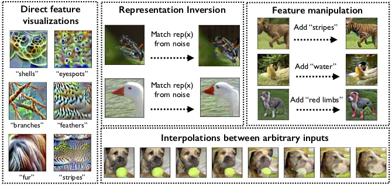

# Code for "Learning Perceptually-Aligned Representations via Adversarial Robustness"

These are notebooks for reproducing our paper "Learning
Perceptually-Aligned Representations via Adversarial Robustness"
([preprint](https://arxiv.org/abs/1906.00945),
[blog](http://gradsci.org/robust_reps)). 



## Running the notebooks

Steps to run the notebooks (for now, requires CUDA):
- Clone this repository with `--recurse-submodules` to include submodules (`--recursive` pre-Git 2.13)
- Download our models from S3: [CIFAR-10](http://andrewilyas.com/CIFAR.pt), [Restricted ImageNet](http://andrewilyas.com/RestrictedImageNet.pt)
- Make a `models` folder in the main repository folder, and save the
  checkpoints there
- Install all the required packages with `pip install -r requirements.txt`
- Edit `user_constants.py` to point to PyTorch-formatted versions of the `CIFAR` and `ImageNet` datasets
- Start a jupyter notebook server: `jupyter notebook . --ip 0.0.0.0`

## Citation

```
@inproceedings{engstrom2019learning,
    title={Learning Perceptually-Aligned Representations via Adversarial Robustness},
    author={Logan Engstrom and Andrew Ilyas and Shibani Santurkar and Dimitris Tsipras and Brandon Tran and Aleksander Madry},
    booktitle={ArXiv preprint arXiv:1906.00945},
    year={2019}
}
```
